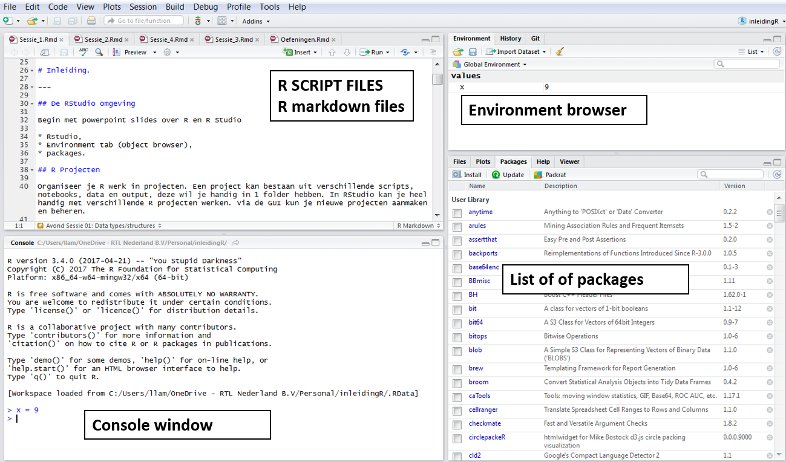
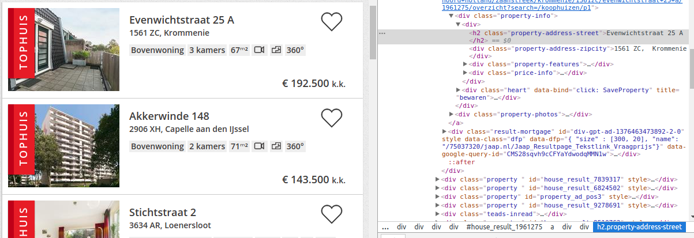
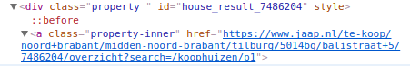

# Inleiding.

---

## De RStudio omgeving

Begin met powerpoint slides over R gevolgd door intro in RStudio:

* Console,
* Script windows,
* Environment tab (Object browser),
* Packages.



## R Projecten

Organiseer je R werk in projecten. Een project kan bestaan uit verschillende scripts, notebooks, data en output, deze wil je handig in 1 folder hebben. In RStudio kan je heel handig met verschillende R projecten werken. Via de GUI kun je nieuwe projecten aanmaken en beheren: File > New Project...


## Scripts 

Scripts, zijn gewone tekst files (*.R) met R code. In RStudio kan je meerdere scripts openen en bewerken. Scripts die bij elkaar horen kan je in een R Project zetten. Via het File menu > New File > R Script kan je in RStudio een nieuw R script file maken. Of gebruik de short cut: Ctrl+Shift+N.

In een script type je R code en als je met de cursor op een regel staat kan je die regel code runnen door Ctrl+Enter in te drukken. Je kan ook meerdere regels selecteren en deze regels runnen door Crtl+Enter. Zie voor meer opties het Code menu en 'Run Region'.


## R Notebooks / Markdown files

R notebooks bevatten meer dan alleen R code, het is een 'compleet' document met R code, output en een beschrijvende verhaallijn. In een R project kun je ook meerdere van deze notebooks en scripts beheren. Notebooks maak je met Rmarkdown, een soort light weight markup language waarin je bijvoorbeeld headers, figuren en vet gedrukt kan specificeren. Deze R cursus werkt met R notebooks. Een notebook bevat **R code chunks** die je kan runnen.

Als je op de 'Preview' knop drukt boven het R notebook krijg je een apart window te zien met het **resultaat van het R notebook**. Er wordt dan ook door RStudio een aparte file gemaakt die de naam <file_naam>.nb.html heeft. Dit is een html file die je kan delen met anderen.
 
Naast de nb.html, kan je een R notebook ook "knit" ('breien') tot een html, pdf of Word document. De header van het markdown document vertelt hoe het een en ander gebreid moet worden. Zie bijvoorbeeld dit document. Naast de 'Preview' knop zie je een pijltje waaruit je kan kiezen.

Latex formules in markdown, geen probleem....

$$ \lim_{x \to \infty} \exp(-x) = 0 $$


## De R Console

De R Console is een plek waar je snel even een kort stukje code wilt runnen. Type daar een R expressie in en Enter om te runnen. Output van scripts verschijnt ook in de R Console.

## Git version controle

Git is een version control systeem. In RStudio kan je makkelijk git gebruiken. Je zult het wel eerst moeten installeren. Op windows kan je git installeren via [de git site](https://git-scm.com/download/win). We gaan hier in deze cursus verder niet op in.

<br>

***

### **OEFENING 1**

Maak een eerste RStudio project aan met een script file, een markdown file en het object `x` met waarde 123

***


<br>


# The tidyverse

---


Het `tidyverse` package is een verzameling R packages met 'dezelfde' gedachtegoed om data te bewerken / manipuleren. Installeer tidyverse en attach de library zodat je in 1 keer een aantal libraries laadt:

* dplyr
* tibble
* ggplot2
* purrr
* forcats
* readr
* readxl
* stringr
* tidyr

```{r libraries, eval=FALSE, include=FALSE}
library(tidyverse)
library(lubridate)
library(anytime)

library(ggplot2)
library(readr)
library(plotly)
library(readr)

library(RColorBrewer)
library(colorRamps)
library(leaflet)
library(rgeos)
library(raster)
library(sp)
library(maptools)
library(rgdal)
library(visNetwork)
```

Merk op: Het is soms niet zo handig om een hele lijst aan libraries aan je R sessie te koppelen. In bovenstaande lijst van packages hebben we nu meerdere packages met de functie `select`.

```{r, eval=FALSE}
getAnywhere("select")
```

Een package kan je detatchen van je huidige sessie met het commando:

```{r, eval=FALSE}
detach(package:raster)
detach(package:plotly)
```

# Data importeren en exporteren

---

## CSV files

In R kan je CSV files importeren met verschillende functies. Mijn voorkeur gaat uit naar de `read_csv` functie in het `readr` package. In base R heb je ook de functie read.csv, alleen deze is veel langzamer dan read_csv.

```{r eval=FALSE}
library(readr)

write_csv(mtcars, "mtcars.csv")
mtcars = read_csv("mtcars.csv")

```


## RDS files

```{r, eval=FALSE}
saveRDS(mtcars, "mtcars.RDs")
mtcars = readRDS("mtcars.RDs")
```


Als je een R object hebt gemaakt, niet alleen een data frame maar elk object kan je deze afzonderlijk saven in een binair formaat (RDS) met de functie `saveRDS`.


# De dplyr library

---

Dit package / library is ontzettend handig om data te bewerken in R. De syntax is elegant en dplyr code kan je in sommige gevallen ook gebruiken voor data die niet in R zit. Bijvoorbeeld, data in Spark kan je met dplyr code bewerken. Er zijn veel 'sleutel' woorden, maar de belangrijkste zijn `select`,  `filter`, `mutate`, `arrange`, `summarize`, `slice` en `rename`. 

Het mooie is dat deze sleutel woorden ook achter elkaar gebruikt kunnen worden met de `%>%` chain operator. We gebruiken als voorbeeld data uit de datasets library. `mtcars` is een klein data set met wat auto gegevens en `iris` is de bekende data set met drie soorten bloemen.


## kolommen selecteren met select

```{r, eval=FALSE}
library(dplyr)
### geneste functie calls vermijden met chain operator
tan(cos(sin(8)))

8 %>% 
  sin() %>% 
  cos() %>% 
  tan()

## enkele kolommen selecteren
my.cars = select(mtcars, hp, mpg, drat)

cos(sin(8))

sin(8) %>% cos()
## via de chain operator, dit is niet alleen handig maar zo kan je verschillende operaties achter elkaar plakken.
my.cars = mtcars %>% 
  select(
    hp, 
    mpg,
    drat
  )

## meerdere kolommen selecteren
test1 = iris %>% 
  select(
    starts_with("Petal")
  )

## bepaalde kolommen selecteren
test2 = mtcars %>% 
  select(
    contains("pg")
  ) %>% 
  select(
      starts_with("c")
  )

## kolommen selecteren op basis van positie
my.cars = mtcars %>% .[2:6]
```

## kolom maken of wijzigen met mutate

We zagen al dat je kolommen in een data frame kon maken of wijzigen met `$` 

```{r, eval=FALSE}
my.cars$kolom2  = rnorm(32)
my.cars$kolom3  = my.cars$kolom2 + 9
```

Maar met `mutate` kan je dit veel eleganter doen

```{r, eval=FALSE}
mycars = mtcars %>%
  select(   
    disp, 
    mpg 
  ) %>%
  mutate(
    displ_l = disp / 61.0237 ,
    tmp = mpg *1000
  )
```

Je kan nieuwe kolommen maken die afhankelijk zijn van kolommen die je net in mutate maakt.

```{r, eval=FALSE}
mycars = mtcars %>%
  mutate(
    displ_l = disp / 61.0237,
    tmp = mpg *1000,
    tmp2 = tmp + 1
  )
```

Je kan ook zelf gemaakte functies gebruiken in mutate.

```{r, eval=FALSE}
normalize = function(x){
    return((x- mean(x))/(max(x)-min(x)))
}

normalize( 1:1000 )

# test run van de functie
normalize(1:10) 

# in mutate
mycars = mtcars %>%
  mutate(
    cyln = normalize(cyl)
  )
```

Twee functies die ontzettend handig kunnen zijn: `mutate_at` en `mutate_if`.

```{r, eval=FALSE}
ABT = data.frame(
  matrix(round(100*runif(100)), ncol=10)
)

## maak eerst een kolom die de som is van de de 10 kolommen
ABT = ABT %>% mutate(sum = rowSums(.[1:10]))

## verander alleen kolom 4 t/m 8, ze worden door sum gedeeld
ABT2 = ABT %>% 
  mutate_at(
    4:8, sin
  )

ABT2 = ABT %>% 
  mutate_at(
    4:8, funs(. / sum)
  )

ABT2 = ABT %>% 
  mutate_at(
    4:8, log
  )


## deel alleen door de sum als de kolom som groter is dan 500
LARGE = function(x) {sum(x) > 500}

LARGE(1:10)

ABT3 = ABT %>% 
  mutate_if(
    LARGE, funs(. / sum)
  )

ABT
ABT2
ABT3
```


<br>

***

### **OEFENING 2 **

1. Importeer de data in de file boodschappen.RDs en importeer de data in de file Restaurants.csv

2. De restaurant data set bevat een kolom aantalreviews, maak een kolom arvLog als log(aantalreviews)

3. De kolom straat hebben we niet nodig, laat die kolom weg in de data set
***

<br>


## distinct rows

Soms wil je data ontdubbelen, dit kan je in R doen met de functie `distinct`

```{r, eval=FALSE}
distinct( select(mtcars, carb, gear))

distinct(select(mtcars, 10,11))

### pipe / chain operatie
myset = mtcars %>% 
  distinct()
```


## data sets filteren

Met `filter` en `slice` kan je rijen uit een data frame halen. 

```{r, eval=FALSE, include=FALSE}
filter(
  mtcars, 
  cyl == 8 & gear > 3
)

## meerdere filter expressie bekenen EN

filter(
  mtcars, 
  cyl == 8,
  gear > 3
)

## als je of wilt moet je | gebruiken

filter(
  mtcars, 
  cyl == 8 | gear > 3
)
```

Met `slice` kan je op basis van row numbers data selecteren. Als voorbeeld, de eerste 8 records, of record 8 tot en met de laatste record.

```{r, eval=FALSE}
slice(mtcars, 1:8)
slice(mtcars, 8:n())

tail(mtcars, 10)
```


## data sets aggregeren

Aggregeren met de functie `group_by` en `summarise` deze gaan vaak hand in hand samen.

```{r, eval=FALSE}
## apart aanroep van group_by en summarise... zo kan je zien wat group_by oplevert
by_cyl = group_by(mtcars, cyl) 


class(by_cyl)

summarise(by_cyl, Naampje1 = mean(disp), Naampje2 = mean(hp))

## maar vaak doe je de twee in 1 run samen
out = mtcars %>%
  group_by(
    cyl
  ) %>% 
  summarise(
    mdisp = mean(disp),
    mhp = mean(hp),
    n = n(),
    nd = n_distinct(mpg)
  )


out = filter(
  mtcars, mpg > 11
  ) %>%
  group_by(
    cyl, 
    carb
  ) %>% 
  summarise(
    N = n(), 
    MeanDisp = mean(disp),
    SD_HP = sd(hp)
  ) %>% 
  filter( N > 1)
```


## joins

Met dplyr kun je makkelijk tabellen joinen. Er zijn verschillende joins die ondersteunt worden. We geven hier een aantal voorbeelden.

```{r, eval=FALSE}
### maak twee data frames aan
df1 = data.frame(
  col1 = c(1,2,3,4,5), tt = rnorm(5)
)

df2 = data.frame(
  col1 = c(3,4,5,6,7), xx = rnorm(5), zz = runif(5)
)

## selecteer rijen die zowel in df1 en df2 zitten 
df3 = inner_join(
  df1, 
  df2,
  by = c("col1" = "col1")
)

## alle rijen die in df1 zitten, geen match levert NA op
df4 = left_join(
  df1,
  df2,
  by = c("col1" = "col1")
)

## alle rijen die in df2 zitten
df5 = df1 %>% right_join(
  df2,
  by = c("col1" = "col1")
)

## alleen de rijen van df1 die niet in df 2 zitten
df6 = df1 %>% anti_join(
  df2,
  by = c("col1" = "col1")
)

## alle rijen van df1 en df2
full_join(df1, df2, by = c("col1" = "col1"))
```


<br>

***

### **OEFENING 3**

1. Er zijn een aantal restaurants zonder reviews (NA waard) haal deze uit de data set
2. Hoeveel restaurants zijn er in Zwolle?
3. Maak een data set waarin per keuken het gemiddeld aantal reviews wordt weergeven.

***

<br>
<br>

## data frames stapelen of plakken

Soms wil je twee tabellen op elkaar stapelen tot een nieuwe tabel, dat kan je doen met `bind_rows`. Als je twee tabellen naast elkaar wilt zetten tot een nieuwe tabel, gebruik dan `bind_rows`.

```{r, eval=FALSE}
## bind_rows
A = data.frame(x=1:5, y = rnorm(5))
B = data.frame(x=11:15, y = rnorm(5))
C = bind_rows(A,B)

## kolommen die niet in een van de data frames zitten worden aangevuld
E = data.frame(x=21:25, y = rnorm(5), z = rnorm(5))

bind_rows(A,E)
```

```{r, eval=FALSE}
A = data.frame(x=1:5, y = rnorm(5))
B = data.frame(q=11:15, q = rnorm(5))
bind_cols(A,B)

## als een van de data frames meer rijen heeft, dan wordt er NIET aangevuld
A = data.frame(x=1:5, y = rnorm(5))
B = data.frame(q=11:17, q = rnorm(7))
bind_cols(A,B)
```

<br>

# Tidy data en wide data

---

Tidy data is wanneer data in de volgende vorm zit:

* Elke variabele is in een kolom.
* Elke observatie is een rij.
* Elke waarde is een cel.

Stel we hebben de volgende data set

```{r, eval=FALSE}
library(tidyr)
stocks <- data.frame(
  time = as.Date('2009-01-01') + 0:9,
  X = rnorm(10, 0, 1),
  Y = rnorm(10, 0, 2),
  Z = rnorm(10, 0, 4)
)
stocks
```

Soms is het handig om data waarden in 1 kolom te hebben en een aparte variabele die de variabele weergeeft

```{r, eval=FALSE}
stocksm <- stocks %>% gather(stock, price, -time)


stocksm %>% group_by(stock) %>%  summarise(m = mean(price))
```

en spread is het omgekeerde proces

```{r, eval=FALSE}
stock2 = stocksm %>% spread(stock, price)
stock2
 
## als er niet even veel observaties zijn?

test = data.frame(
  T = c(1,2,3,1,2), 
  V = c("A","A","A","B","B"),
  price = c(4,5,6,7,8)
)

test2 = test %>% spread(V,price)
test2
```

Een handige functie in tidyr is `separate`, dit kan je gebruiken om een kolom uit elkaar te trekken. Standaard worden niet alfa numerieke tekens als separator gebruikt.

```{r, eval=FALSE}
df = tibble(x = c("A.B", "C.P", "P.Q"))

df %>% separate(x, c("Kol1", "Kol2"))

## Er kunnen tw weinig of teveel kolommen zijn.
df = tibble(x = c("A.B", "C.P", "P.Q", "pp", "P.2.4"))
df %>% separate(x, c("Kol1", "Kol2"))


df = tibble(x = c("A.B", "C,P", "P.Q", "pp", "P.2.4"), sep = "a")
df %>% separate(x,    paste0("kol", 1:10))
```


<br>

# Character data bewerken met het package `stringr`.

---

Character data in R kan je bewerken/manipuleren met het `stringr` package. Voordat we daar verder op in gaan is het handig om te weten wat reguliere expressies zijn.

## Reguliere expressies

Dit is een soort 'mini' taaltje om character patronen te specificeren om er vervolgens bijvoorbeeld op te zoeken. Eerst wat dummy character data.

```{r, eval=FALSE}
test = c(
  "Mijn nummer is 06-12345678", 
  "dit is .. een 1628EP postcode test", 
  "foutje?:  0234XD", 
  "dit is er nog een 1628 EP", 
  "en nog een foute 126EP", 
  "nog een 1234    XX", 
  "1234eZ en nog 4567PK", 
  "12345 Aabcde", "&yfy."
)
test
```

Een paar voorbeelden van reguliere expressies.

```{r stringr, eval=FALSE}
library(stringr)

## een digit, en precies 1 digit
patroon = "\\d"
str_extract(test, patroon)

## 1 of meerdere digits
patroon = "\\d+"
str_extract(test, patroon)

## precies twee letters
patroon ="[[:alpha:]]{2}"
str_extract(test, patroon)

## Een postcode
patroon = "\\d{4}\\s?[[:alpha:]]{2}"
str_extract(test, patroon)

## Maar een postcode begint niet met een 0
patroon = "[1-9]\\d{3}\\s?[[:alpha:]]{2}"
str_extract(test, patroon)

## special punctuation characters !"#$%&’()*+,-./:;<=>?@[]^_`{|}~
patroon = "[[:punct:]]"
str_extract(test, patroon)
```

Sommige mensen zijn de wildcard notatie gewend om te zoeken in strings, deze wildcard notatie kan je vertalen naar reguliere expressies met `glob2rx`. Een paar voorbeelden zullen hieronder geven. 

```{r, eval=FALSE}
patroon = glob2rx("*23*")
str_extract(test, patroon)
```

Voor een cheatsheet over reguliere expressies zie [regex cheatsheet](https://www.rstudio.com/wp-content/uploads/2016/09/RegExCheatsheet.pdf)

## functies uit het package stringr

In het package `stringr` zijn diverse functies om met characters te werken, een aantal zullen we laten zien

```{r, eval=FALSE}
testset = titanic::titanic_train %>% select(Name)
## maak extra kolom aan in titanic die namen zoekt
testset = testset %>%
  mutate(
    naamlengte = str_length(Name),
    Ownes = str_detect(Name, 'Owen'),
    Plek = str_locate(testset$Name, "Mr") %>% .[,1],
    Name2 = str_replace(Name, "Mr", "")
  )

str_locate(testset$Name, "Mr")
```


<br>

***

### **OEFENING 4**

1. Welk restaurant heeft de langste naam? En welke de kortste?
2. Zijn er restaurantnamen die met een Q beginnen? Welke?
3. Zijn er restaurantnamen met een Q in de naam en niet met Q beginnen? Welke? 

***

<br>
<br>

# Factor manipulatie met forcats

---

In R kun je factor variabelen bewerken met functies uit het `forcats` package. We geven een aantal voorbeelden op random gegenereerde data

```{r, eval=FALSE}
library(forcats)

x = rnorm(1000)
y = sample(LETTERS[1:10], replace = TRUE, size = 1000, prob = (1:10)^2)

test = tibble(gewicht = x, type = y)
table(test$type)
```

Samenvoegen van levels: Op aantallen (Weinig voorkomende levels) of handmatig

```{r, eval=FALSE}
test = test %>% 
  mutate(
    z = fct_lump(type, n=5)
  )

table(test$z)

test = test %>% 
  mutate(
    z2 = fct_other(type, keep = c("C","B")),
    z3 = fct_other(type, drop = c("A","B"))
  )

table(test$z2)
table(test$z3)
```

Hernoemen van factor levels

```{r, eval=FALSE}
test = test %>% 
  mutate(
    z2 = fct_recode(
      type,
      ZZ = "A",
      ZZ = "B",
      YY = "C", 
      YY = "D"
    ),
    z3 = fct_collapse(
      type,
      missing = c("B", "C"),
      other = "D",
      rep = c("E", "F"),
      ind = c("G","H"),
      dem = c("I","J")
    )
  )
table(test$z2)
table(test$z3)
```

Herordenen van factor levels, factor levels kunnen een order bevatten, deze kan je maken of veranderen, kan soms nodig zijn bij plotten.

```{r, eval=FALSE}
test = test %>% 
  mutate(
    type2 = fct_reorder(type, gewicht, mean)
  )

table(test$type)
table(test$type2)

levels(test$type)
levels(test$type2)

## hier een voorbeeld van het verschil in plaatjes

library(ggplot2)

test2 = test %>% 
  group_by(type) %>% 
  summarise( gewicht = mean(gewicht))

ggplot(test2, aes(x=type)) + geom_bar(aes(weight=gewicht))

test2 = test %>% 
  group_by(type2) %>% 
  summarise( gewicht = mean(gewicht))

ggplot(test2, aes(x=type2)) + geom_bar(aes(weight=gewicht))
```

<br>


# Dates and times in R

---

Voor datums (en tijden) in R zijn de packages `anytime` en `lubridate` heel handig. Laten we er van uitgaan dat we characters hebben met datums en daar mee willen rekenen. Dan kunnen we de functie `anydate` uit het anytime package gebruiken.

```{r, eval=FALSE}
library(lubridate)
library(anytime)

y = c("1973-09-12", "1980-05-23", "1981-12-09")

testdata = tibble(DoB = y)

testdata = testdata %>%
  mutate(
    GeboorteDatum = anytime::anydate(DoB)
  )
```

De functie `anydate` parsed diverse character notatie naar een date kolom, de gaat meestal goed :-)

```{r, eval=FALSE}
y = c("1973/09/12", "05/23/1980", "23/05/1980","1981-12-09")

testdata = tibble(DoB = y)

testdata = testdata %>%
  mutate(
    GeboorteDatum = anytime::anydate(DoB)
  )
```

Nu we een datum echt als date column in een data frame of tibble hebben kunnen we er mee rekenen.

```{r, eval=FALSE}
testdata = testdata %>%
  mutate(
    leeftijd = today() - GeboorteDatum,
    leeftijd2 = as.numeric(today() - GeboorteDatum)/365,
    dag = wday(GeboorteDatum, label=TRUE)
  )
```

*UNIX time stamps*....  Wat zeg je?

Een Unix time stamps is het aantal seconden sinds 1-1-1970. Mocht je dit ooit tegen komen dan kan anytime er ook mee uit de voeten.

```{r, eval=FALSE}
library(readr)
tmp = read_csv("data/unixtimestamps.csv")
tmp$datum = anydate(tmp$timestamp)
tmp
```


Tijdstippen kunnen in R ook worden weergegven met times


```{r, eval = FALSE}
tmp = paste("2018-01-23", c("12:01:33", "12:01:38", "12:01:58"))
Waarde = c(2.4, 5.6, 7.8)

MeetData = tibble(tmp = tmp, Waarde= Waarde)

MeetData = MeetData %>% 
  mutate(
    Meettijdstip = ymd_hms(tmp)
  )

```


## durations en intervals

Als je in R twee datums/times van elkaar aftrekt krijg je in R een duration 

```{r, eval = FALSE}
MeetData = MeetData %>% 
  mutate(
    duur = ymd_hms("2018-02-01 00:00:00") - ymd_hms(tmp)
  )

```

Ja kan durations ook zelf maken en optellen bij een datum

```{r, eval = FALSE}
testduur = dweeks(3)
testduur = dweeks(3.1)
class(testduur)

MeetData = MeetData %>% 
  mutate(
    t2 = Meettijdstip + dyears(2),
    t3 = Meettijdstip + dseconds(1800),
    t4 = Meettijdstip + dweeks(3)
  )
```


In R heb je ook zogenaamde `interval` objecten, dit is de tijdsperiode tussen een start en eind datum. Hiermee kan je de leeftijd in jaren ook precies uitrekenen.

```{r, eval = FALSE}

y = c("1973-10-12", "1973-01-09")

testdata = tibble(DoB = y)

testdata = testdata %>%
  mutate(
    GeboorteDatum = anydate(DoB),
    interval1 = interval(GeboorteDatum, today()),
    interval2 = GeboorteDatum %--% today(),
    leeftijd = interval1 %/% years(1)
  )

testdata

# NB %/% is de integer division in R
13 / 6
13 %/% 6

`+`(9,1)
```


<br>

***

### **OEFENING 5**

1. Hoeveel dagen zitten er tussen 1991-02-15 en 3 mei 2004? en hoeveel weken?
2. Bekijk de restaurants data set nogmaals, de kolom keuken bevat teveel keukens
maak een nieuwe variabele die alleen de top 10 keuken neemt op aantal en de rest in "Overige" zet.

***

<br>

# dplyr met externe data

Je kan `dplyr` niet alleen gebruiken op data frames in R, ook kan je `dplyr` gebruiken op externe data in databases en, ook data in Spark. We geven hier eerst het Spark voorbeeld met het package `sparklyr`, en dan een MySQL voorbeeldje.

```{r, eval=FALSE}
library(sparklyr)
library(dplyr)

## maak een connectie naar spark
sc <- spark_connect(master = "local")

## nu zie je ook in RStudio een Spark connection met spark data sets
## en een link naar de spark User Interface

## upload data naar spark, zie ook connections tab
iris_tbl <- copy_to(sc, iris)

## nu kan je dplyr gebruiken op spark
test = iris_tbl %>% filter(Sepal_Length >5)

class(test)
test %>% count()
```

Als je klaar bent: disconnect van Spark

```{r, eval=FALSE}
spark_disconnect(sc)
```

Als je MySQL hebt en een odbc connectie hebt opgezet  kan je een link leggen naar MySQL. Zie bijvoorbeeld ook [deze link](https://askubuntu.com/questions/800216/installing-ubuntu-16-04-lts-how-to-install-odbc)

```{r, eval=FALSE}
library(odbc)
library(DBI)
library(dplyr)

## maak een connectie naar mySQL, zie ook connections tab
con_sql <-  dbConnect(odbc::odbc(), "my-connector")

## laat zien welek tabelllen er zijn 
dbListTables(con_sql)

## copier lokale R data frames naar MySQL
dbWriteTable(conn = con_sql, name = 'mtcars_test', value = mtcars)

## je hebt een'handle' nodig naar een tabel, daar kan je dplyr op gebruiken
tbl_handle = tbl(con_sql, "mtcars")

tbl_handle %>% count()


zz = tbl_handle %>% filter(disp > 260) 
class(zz)

lokaledata = zz %>% collect()
```

Als je klaar bent: disconnect van MySQL

```{r eval=FALSE}
dbDisconnect(con_sql)
```


# Interactive grafieken

---

Naast de statistische grafieken die we hierboven hebben gemaakt kan je in R ook interactieve grafieken maken. We geven in deze sectie een aantal voorbeelden.

## Het plotly package

Plotly is een zeer mooie library voor het maken van interactieve visualisaties. Zie voor meer info [plotly](https://plot.ly/r/). We zullen een aantal voorbeelden hieronder laten zien.

### scatters

```{r, eval=FALSE}
library(plotly)
mtcars = mtcars
mtcars$naampjes = row.names(mtcars)

plot_ly(data = mtcars, x = ~mpg, y = ~wt)

plot_ly(data = mtcars, x=~mpg, y = ~wt, color = ~cyl)
plot_ly(data = mtcars, x=~mpg, y = ~wt, text = ~naampjes)
```


### barcharts

We gebruiken de restaurants data set weer

```{r,eval=FALSE}
Restaurants <- readr::read_csv("data/Restaurants.csv")
keuken = Restaurants %>% dplyr::group_by(keuken) %>% dplyr::summarise(n=n())

p = plot_ly(data = keuken,
  x = ~keuken,
  y = ~n,
  type = "bar"
)

p
```

Sorteren op volgorde van aantallen kan je doen door reorder factor

```{r, eval=FALSE}
keuken = keuken %>%
  mutate(
  keuken = forcats::fct_reorder(keuken,n, .desc=TRUE)
)
p = plot_ly(data = keuken,
  x = ~keuken,
  y = ~n,
  type = "bar"
)

p
```

### boxplots

```{r, eval=FALSE}
p = plot_ly(data = Restaurants, y = ~aantalreviews, color = ~keuken,type = "box")
p
```

### 3D plots

If you have 3D data you can plot it in a 3D scatter plot 

```{r, eval=FALSE}
p = plot_ly(data = mtcars, x=~mpg, y=~cyl, z = ~disp) 
p
```
A matrix with values can be plotted as a 3D surface plot

```{r, eval=FALSE}
volcano
plot_ly(z = ~volcano) %>% add_surface()
```

### ggplot integratie

Je kan een grafiek maken met ggplot en dan de functie ``ggplotly` gebruiken om de grafiek interactief te maken. Als de grafiek veel punten bevat kan het sloom over komen.  Vandaar dat onderstaande voorbeeldje alleen 3000 punten sampled.

```{r, eval=FALSE}
p = ggplot(
  data = diamonds %>% dplyr::sample_n(3000),
  aes(x = carat, y = price)
) +
  geom_point(
    alpha = 0.05, 
    aes(text = paste("Clarity:", clarity))
  ) +
  geom_smooth(aes(colour = cut, fill = cut)) + 
  facet_wrap(~ cut)
p

ggplotly(p)
```


<br>

***

### **OEFENING 6**

1. Maak een plotly bar chart, x as is keuken, en elke bar is de gemiddelde prijs in een keuken. Pas op missende prijzen.
2. Er zijn te veel keukens pak alleen de top 25 restaurants (op basis van gemiddelde prijs)

***

<br>

## Kaartjes met leaflet

Leaflets worden gebruikt om interactieve kaartjes te maken. By deault gebruiken open street maps als achtergrond.

```{r, eval=FALSE}
library(leaflet)

m <- leaflet() %>%
  addTiles() %>%  # Add default OpenStreetMap map tiles
  addMarkers(lng=174.768, lat=-36.852, popup = "The birthplace of R")
m  

# kan geblokt worden door fire walls.
```

Plot de restaurants in Zwolle op een kaartje. Data van Iens gescraped.

```{r, eval=FALSE}
Restaurants <- read.csv("data/Restaurants.csv")
Zwolle = Restaurants %>% filter(plaats == "Zwolle")

## tooltip teksten kunnen geplaatst worden
ptekst = paste(Zwolle$restNamen, '<BR> aantal reviews: ', Zwolle$aantalreviews)

m2 = leaflet(data = Zwolle)
m2 = m2 %>%
  addTiles() %>%  # Add default OpenStreetMap map tiles
  addMarkers(lng = ~LONGs, lat = ~LATs, popup = ptekst)
m2  
```

Je kan kleurtje gebruiken, gebruik dan `addCirclemarkers`

```{r, eval=FALSE}
reds = colorNumeric("Reds", domain = NULL)

Zwolle = Zwolle %>% filter(!is.na(aantalreviews), aantalreviews < 80)
ptekst = paste(Zwolle$restNamen, '<BR> aantal reviews: ', Zwolle$aantalreviews)

m2 = leaflet(data = Zwolle)
m2 = m2 %>%
  addTiles() %>%
  addCircleMarkers(
    lng = ~LONGs,
    lat = ~LATs, 
    fillColor = ~reds(aantalreviews), 
    fillOpacity = 1, popup = ptekst
  )
m2
```


### polygonen op een leaflet

Je kan ook vormen/polygons op een leaflet kaart krijgen. Hieronder is een voorbeeld van provincies, eerst moet je de data van de polygonen hebben. Dit staat in zogenaamde shape files van de provincies, deze kan je downloaden van http://www.imergis.nl/asp/47.asp. Op deze site zie je provinciegrenzen_exact, download deze en pak deze uit. In mijn data directory is dat al gedaan. 

Eerst is er een beetje voorbewerking nodig om de shape file te bewerken in R tot een zogenaamde SpatialPolygonsDataframe. Dan kan je dit met leaflet te kunnen plotten.

```{r, eval = FALSE}
#### inlezen shape file
ProvNL <- readShapeSpatial("data/TopGrenzen-prov-actueel.shp")
class(ProvNL)
summary(ProvNL)

#### Zet coordinatensysteem
proj4string(ProvNL) <- CRS("+init=epsg:28992")

#### transformeer naar long /lat
ProvNL = spTransform(ProvNL, CRS("+proj=longlat +datum=WGS84"))

#### Het object ProvNL is een zgn spatialpolygons object, daar zit een data frame in
ProvNL@data

#### maak een hele simpele plot
plot(ProvNL)
```

Maar nu kun je het spatial polygons object ook op een leaflet plotten.

```{r, eval = FALSE}
leaflet(ProvNL) %>%
  addTiles() %>%
  addPolygons(
    stroke = TRUE, weight = 1, fillOpacity = 0.15, smoothFactor = 0.15
  )
```

Je kan de kleuren van de provincies ook veranderen

```{r, eval=FALSE}
ProvNL$Kleur = sample(c("red","blue"), 12, replace = TRUE)

ProvNL@data

leaflet(ProvNL) %>%
  addTiles() %>%
  addPolygons(
    stroke = TRUE, weight = 1, fillOpacity = 0.25, smoothFactor = 0.15, fillColor = ~Kleur
  )

```

** Kleuren Schemas **

De kleuren kan je ook data gedreven met een kleuren schema bepalen. 

```{r, eval = FALSE}
#### maak eerst wat data voor de provincies
ProvNL$Leeftijd = runif(12)

### definieer een 3 niveau schema
colpal <- colorQuantile(
  palette = green2red(3), n=3,
  domain = ProvNL$Leeftijd
)

### gebruik kleurtjes en een popup tekst
leaflet(ProvNL) %>%
  addTiles() %>%
  addPolygons(
    stroke = TRUE, 
    weight = 1, 
    fillOpacity = 0.25, 
    smoothFactor = 0.15, 
    fillColor = colpal(ProvNL$Leeftijd),
    popup = as.character(ProvNL$Leeftijd)
  )

```


Hieronder is een voorbeeld om op postcode 2 posities niveau een kaart te maken. We hebben eerst de data nodig die de contouren van een PC2 gebied definieert, en dan is er wat preparatie nodig om de data in polygoon objecten te krijgen. Deze gaat iets anders dan de provincies die in 1 shape file stonden.

```{r, eval = FALSE}
# importeer data uit een CSV file
pc2_kaart <- read_csv("data/pc2_kaart.csv")
PC2_data = dplyr::select(
  pc2_kaart, 
  Longitude,
  Latitude, 
  PC2CODE ) %>%
  as.data.frame()

# Het moet een lijst van gebieden zijn.
Pc2_list = split(PC2_data, PC2_data$PC2CODE)
Pc2_list = lapply(Pc2_list, function(x) { x["PC2CODE"] <- NULL; x })


### Maak van elk lijst object een Polygon
plg = sapply(Pc2_list, Polygon)

plg[[1]]
```

Nu gaan we per PC2 gebied het aantal restaurants tellen en dit in een kaartje zetten.

```{r, eval = FALSE}
PC2 = Restaurants %>%
  mutate(
    PC2 = stringr::str_sub(PCs,1,2)
  ) %>%
  group_by(PC2) %>%
  summarise(n=n()) %>% 
  filter(PC2 >= "10")

## initieer de leaflet en voeg PC2 polygon 1 voor 1 toe

pc2_lf = leaflet() %>%  addTiles() 

## definieer een kleuren schema
colpal <- colorQuantile(
  palette = green2red(7), n=7,
  domain = PC2$n
)

## elk polygoontje krijgt nu op basis van zijn restaurant aantal het 'juiste' kleurtje

### teken per polygon, dat is het makkelijkst
for (i in 1:length(plg)){
  ptxt = paste(
    "PC2: ", as.character(PC2$PC2[i]),
    "<br>",
    "Aantal Restaurants",
    as.character(PC2$n[i])
  )
  pc2_lf = pc2_lf %>%
    addPolygons(
      data = plg[[i]],
      weight = 2,
      smoothFactor = 1,
      fillOpacity = 0.55,
      fillColor= colpal(PC2$n[i]),
      popup = ptxt
    )
}

pc2_lf
```


popup texts in leaflets kunnen ook images en animated animated images bevatten. See as an example [this leaflet of Amsterdam](http://www.lhldsd.nl/AmsterdamWijkenOverzichtAnimated.html) en [this shiny app](http://145.131.21.163:3838/sample-apps/amsterdam_panoramaimages/)


## Extra openstreetmap data met library osm en verschillende iconen

Zie het script osm_test.R en leaflet_icons.R

<br>

---


<br>


## Netwerk grafieken, visnetwork

Het package `visnetwork` kan worden gebruikt om interactieve netwerk grafieken te maken. Je hebt twee data frames nodig, een met de nodes en een met de edges. Laten we beginnen met een simpel voorbeeldje.

```{r, eval=FALSE}
library(visNetwork)

nodes = data.frame(
  id = c(1,2,3,4)
)
edges = data.frame(
  from = c(1,3,4), 
  to  = c(2,2,2)
)

visNetwork(nodes, edges)
```


Er zijn diverse opties die je kan meegeven. Een deel van de opties kan je via de data frames meegeven.

```{r, eval=FALSE}
nodes <- data.frame(
  id = 1:10,
  label = paste("Node", 1:10),                                   # labels
  group = c("GrA", "GrB"),                                       # groups
  value = 1:10,                                                  # size
  shape = c("square", "triangle", "box", "circle", "dot", "star", "ellipse", "database", "text", "diamond"),    # shape
  title = paste0("<p><b>", 1:10,"</b><br>Node !</p>"),           # tooltip
  color = c("darkred", "grey", "orange", "darkblue", "purple"),  # color
  shadow = c(FALSE, TRUE, FALSE, TRUE, TRUE))                    # shadow

edges <- data.frame(from = sample(1:10,8), to = sample(1:10, 8),
  label = paste("Edge", 1:8),                                 # labels
  length = c(100,500),                                        # length
  arrows = c("to", "from", "middle", "middle;to"),            # arrows
  dashes = c(TRUE, FALSE),                                    # dashes
  title = paste("Edge", 1:8),                                 # tooltip
  smooth = c(FALSE, TRUE),                                    # smooth
  shadow = c(FALSE, TRUE, FALSE, TRUE))                       # shadow

visNetwork(nodes, edges)
```


Andere opties kan je via de functie `visnetwork` meegeven. Bijvoorbeeld highlight nearest

```{r, eval=FALSE}
nodes <- data.frame(
  id = 1:15,
  label = paste("Label", 1:15),
  group = sample(LETTERS[1:3], 15, replace = TRUE)
)

edges <- data.frame(
  from = trunc(runif(15)*(15-1))+1,
  to = trunc(runif(15)*(15-1))+1
)

visNetwork(nodes, edges) %>% 
  visOptions(
    highlightNearest = TRUE,
    nodesIdSelection = TRUE
  )
```

Nog een netwerk voorbeeldje van restaurant bezoekers in het mooie stadje Hoorn. Bij het scrapen van Iens, kan je ook zien dat een reviewer eerst een bepaald restaurant heeft gereviewed en dan een ander, dat is in een netwerk graph te zetten. 

Focus nu alleen op het mooie stadje Hoorn.

```{r, eval=FALSE}
Hoornnodes = readRDS("data/HoornNodes.RDs")
HoornEdges = readRDS("data/HoornEdges.RDs")

visNetwork(Hoornnodes, HoornEdges) %>% 
  visLegend() %>%
  visOptions(
    highlightNearest = TRUE, 
    nodesIdSelection = TRUE
  ) %>%
  visInteraction(
    navigationButtons = TRUE
  ) %>%
  visPhysics( maxVelocity = 25)

```


# Zoomable circle packing plots, sunburst plots en chord diagrams

Circle packings zijn een leuke manier om hierarchische data te visualiseren. Installeer eerst het package van Github.

```{r, eval = FALSE}
devtools::install_github("jeromefroe/circlepackeR")
```

Maak wat dummy data aan. Volgend voorbeeldje is een hierarchische lijst.

```{r, eval= FALSE}
hierarchical_list <- list(
  name = "World",
  children = list(
    list(name = "North America",
         children = list(
           list(name = "United States", size = 308865000),
           list(name = "Mexico", size = 107550697),
           list(name = "Canada", size = 34033000))),
    list(name = "South America", 
         children = list(
           list(name = "Brazil", size = 192612000),
           list(name = "Colombia", size = 45349000),
           list(name = "Argentina", size = 40134425))),
    list(name = "Europe",  
         children = list(
           list(name = "Germany", size = 81757600),
           list(name = "France", size = 65447374),
           list(name = "United Kingdom", size = 62041708))),
    list(name = "Africa",  
         children = list(
           list(name = "Nigeria", size = 154729000),
           list(name = "Ethiopia", size = 79221000),
           list(name = "Egypt", size = 77979000))),
    list(name = "Asia",  
         children = list(
           list(name = "China", size = 1336335000),
           list(name = "India", size = 1178225000),
           list(name = "Indonesia", size = 231369500)))
  )
)
```

and plot it 

```{r, eval=FALSE}
circlepackeR::circlepackeR(hierarchical_list)
```

The above code is not convenient to plot data that are in data frames. For example click data or web path logs. Let's take the following data example from the traamap package.

```{r}
library(dplyr)
library(circlepackeR)
library(data.tree)
library(treemap)

# Gross national income data
data(GNI2014)
GNI2014

# create one column with a path string
GNI2014 = GNI2014 %>% 
  mutate(
    webpath = paste("world", continent, country, sep = "/")
  )

# transform this data to a hierarchical tree that is suitable for circlepackR
# 
population <- as.Node(GNI2014, pathName = "webpath")
circlepackeR(population,  size = "population")
circlepackeR(population,  size = "GNI")
```


Interactieve sunburst plots kan je ook mooi gebruiken voor hierarchische data.

```{r, eval=FALSE}
library(sunburstR)

seqData = read.csv(
  file = paste0(
    "https://gist.githubusercontent.com/mkajava/",
    "7515402/raw/9f80d28094dc9dfed7090f8fb3376ef1539f4fd2/",
    "comment-sequences.csv"
  )
  ,header = TRUE
  ,stringsAsFactors = FALSE
)
  
sunburst(
  seqData
)

sunburst(
  seqData
  ,count = TRUE
)

## aangepaste text in het midden 
sunburst(
  seqData
  # apply sort order to the legends
  ,legendOrder = unique(unlist(strsplit(seqData[,1],":")))
  # just provide the name in the explanation in the center
  ,explanation = "function(d){return d.data.name}"
)
```

Chord diagrams zijn een leuke manier om "A naar B" data weer te geven, relaties tussen entiteiten.

```{r, eval=FALSE}
#devtools::install_github("mattflor/chorddiag")
library(chorddiag)

# overgangsmatrix
m <- matrix(
  c(11975,  5871, 8916, 2868,
    1951, 10048, 2060, 6171,
    8010, 16145, 8090, 8045,
    1013,   990,  940, 6907
  ),
  byrow = TRUE,
  nrow = 4, ncol = 4
)

haircolors <- c("black", "blonde", "brown", "red")
dimnames(m) <- list(have = haircolors, prefer = haircolors)
m

groupColors <- c("#000000", "#FFDD89", "#957244", "#F26223")
chorddiag(m, groupColors = groupColors, groupnamePadding = 20)
```


# Web Scraping met rvest

## Een mini uitstapje naar purrr en furrr eerst

Het package `purrr` verbeterd de functional programming tools van R. Een simpel voorbeeldje

```{r eval = FALSE}
library(purrr)

myf = function(x, power = 2)
{
  x^power
}

myf(7)

## list output, soms niet handig
map (  1:100, myf)

## vector output
map_dbl(1:100, myf)

## extra argumenten aan de functie kunnen aan de map functie worden gegeven.
map_dbl(1:100, myf, power = 3)
```

Ook data frames / tibbles kunnen geretourneerd worden.

```{r, eval = FALSE}
myf = function(i){
  x = rnorm(10)
  y = rnorm(10)
  tibble(x,y,iter  = i) 
}

myf(7)

out = map_df(1:10, myf)
```

Volgende voorbeeld leest alle files in die in een directory staan

```{r, eval= FALSE}
## De dir functie zit in nase R maar geeft niet pad mee
impfiles = dir("testimport/")

## het fs package is een uitgebreid package met File System utilities
impfiles = fs::dir_ls("testimport/")
out = map_df(impfiles, readr::read_csv)
```

Met het package `furrr` kan je min of meer het zelfde doen als `purrr`. Het verschil is dat op de achtergrond gebruik wordt gemaakt van het future package. Die stelt je in staat om berekeningen naar de achtergond te duwen en processen in parallele uit te voeren.

```{r}
library(furrr)
library(future)

myf = function(x){
  Sys.sleep(2.5)
  x
}

t0 = proc.time()
purrr::map(1:2, myf)
proc.time() - t0

## zorg ervoor dat de future backend multiprocess is, anders wordt nog steeds
## sequentieel uitgerekend

plan(multiprocess) 
t0 = proc.time()
furrr::future_map(1:4, myf)
proc.time() - t0
```


## Basis voorbeelden scrapen

In R kan je web sites scrapen met het package `rvest`, dit is een heel handig package. Eerst de basics.

```{r, eval = FALSE}
library(rvest)

## Geef een URL op
baseurl = "http://www.jaap.nl/koophuizen/p1"
out = read_html(baseurl)
   
## out is een zogenaamde xml_document object 
class(out)
```

Met verschillende functies kan je nu een xml_document parsen, bestudeer de site met chrome om een idee te krijgen van de elementen en structuur. Met behulp van CSS of  XPath (XML Path-taal of XML Path Language), een querytaal voor het adresseren van onderdelen van XML-documenten, kan je verschillende elementen uit een xml_document krijgen.

Een kort overzicht vind je <a href="https://msdn.microsoft.com/en-us/library/ms256086(v=vs.110).aspx"> hier </a>. Gebruik dubbel slash `//` om alle elementen in een document te vinden, bijvoorbeeld `//h2` om alle h2 elementen in een docuemnt te pakken. Gebruik `@` om attributen te selecteren.




Neem als voorbeeld de straat van het huis, rechts klik op de straat en klik inspect element, het is een `h2` object met een bepaalde `class` property. Deze kan je dan met Xpath als volgt opgeven:

```{r, eval=FALSE}
## pak als voorbeeld de straat
strout  = html_nodes(out,xpath='//h2[@class="property-address-street"]')

## Er zijn 30 van de straat objecten gevonden in de pagina
length(strout)

## Het is een zogenaamde xml_nodeset
class(strout)
strout

## met de `html_text` functie kan je de tekst er uit halen
straat = strout %>% html_text()
straat
```

Nog een voorbeeldje, de prijs van een huis.

```{r, eval=FALSE}
price =  html_nodes(out, xpath='//div[@class="property-price"]') %>% html_text()

## De prijs is zichtbaar maar het is niet handig om te gebruiken
price
```

Gebruik reguliere expressies om de prijs er uit te pulleken en als bruikbaar numeriek veld te hebben.

```{r, eval=FALSE}
library(stringr)

prijs = str_extract(
  price,
  "[:digit:]+[\\.][:digit:]+[\\.]*[:digit:]*"
) %>%
str_replace_all("\\." , "") %>%
  as.numeric()
prijs
```

In de huizen data staan ook per huis een link, deze kan je er ook uit halen.



Het is een `a` tag met `class`="property-inner" waarvan je de href moet hebben, dat kan je als volgt met xpath opgeven.

```{r, eval = FALSE}
linkhuis =  html_nodes(out, xpath='//a[@class="property-inner"]/@href') %>% html_text()
linkhuis
```

In een `for` loop zou je al deze links weer kunnen scrapen.

## Verdere voorbeelden

```{r, eval = FALSE}
tmp = html_form(read_html("https://hadley.wufoo.com/forms/libraryrequire-quiz/"))
class(tmp)
tmp[[1]]$fields$clickOrEnter$name
```

Zie ook de Environment browser waar je het object `tmp` kan browsen. Soms bevat een html pagina een tabel, deze kan je makkelijk vertalen naar een R data set met `html_table`.

```{r, eval = FALSE}
## op deze pagina staan interessante geboorte statistieken
births <- read_html("https://www.ssa.gov/oact/babynames/numberUSbirths.html")

out = html_nodes(births, "table")

## er zijn twee tabellen op de pagina, de tweede bevat aantal M en F geboortes per jaar
mydata = out[[2]] %>% html_table()
```

## Het jaap scrape script

Een compleet script om jaap.nl te scapen zie je [hier](https://github.com/longhowlam/jaap). Switch naar jaap project.

## NOS nieuws site scrapen

Nog een voorbeeld, nieuws archief berichten van de NOS site scrapen. De archieven zijn per dag georganiseerd. Zie bijvoorbeeld de links:

* https://nos.nl/nieuws/archief/2017-10-23/
* https://nos.nl/nieuws/archief/2017-10-22/
* https://nos.nl/nieuws/archief/2017-10-21/
* https://nos.nl/nieuws/archief/2016-10-23/
* etc.

Laten we als voorbeeld de laatste 10 dagen pakken

```{r eval=FALSE}
library(purrr)
library(dplyr)

OUT = data.frame()

## we kunnen handmatig 1 iteratie uitvoeren om te zien of het werkt
j=1

## en nu de rest :-)
for(j in 1:1){
  
  ### Maak de juiste URL aan
  datum = as.character(Sys.Date() - j)
  nieuwslinks = paste0("https://nos.nl/nieuws/archief/", datum)
  
  ### Lees de link in
  out = read_html(nieuwslinks)

  ### dit is een nodeset met artikelen, maar daar moeten we de links uit pulleken
  artikels = html_nodes(
    out, 
    xpath = "//a[contains(@href, 'artikel')]"
  )
  
  ## maak een lijst van attributen waarbij je alleen de href genaamde list objecten pakt
  lijst = artikels %>%   html_attrs()
  
  ## gebruik uit purrr map_chr, waarbij je een lijst langs kan gaan en alleen bepaalde elementen kan pakken
  artikels = lijst %>%  map_chr("href") %>%  unique()
  
  artikels = paste0("https://nos.nl", artikels)

  ### loop nu langs alle artiekelen links 
  
 for(i in 1:length(artikels))
 {
    print(i)
    out2 = read_html(artikels[i])
    art = html_nodes(out2, xpath = '//div[@class="article_textwrap"]') %>% html_text %>% paste(collapse = " ")
    titel = html_nodes(out2, xpath = '//h1[@class="article__title"]') %>% html_text()
    datum = html_nodes(out2, xpath = '//time') %>% html_attrs() %>% .[[1]]
    categorie = html_nodes(out2, xpath='//a[@class="link-grey"]') %>% html_text
    tmp = data.frame(datum, titel, art, link = artikels[i], categorie)
    OUT = rbind(OUT,tmp)
  }
  OUT = OUT %>% distinct()
  print(j)
  print(datum)
  saveRDS(OUT, "nosnieuws.RDs")
  Sys.sleep(2*runif(1))
}
```

## SelectorGadget in chrome

Met de selector gadget plugin (in Chrome) kan je elementen selecteren op een web pagina, je krijgt dan de CSS te zien en kan deze gebruiken in de functie `html_nodes`. Een aantal voorbeelden:

### Hema voorbeeldje 

```{r, eval=FALSE}
### HEMA producten
clean_string = function(x){
  x %>%
    str_remove_all("\n") %>% 
    str_remove_all("\r") %>% 
    str_remove_all("\t") %>% 
    str_trim()
}

hema = "https://www.hema.nl/winkel/baby/babyspeelgoed"
out = read_html(hema)
speelgoed = html_nodes(out, "h4") %>% html_text() %>% clean_string()
prijs = html_nodes(out, ".price") %>% html_text() 
```

### Mediamarkt laptops voorbeeldje

Onderstaande code scrapet een pagina met laptops van mediamarkt.

```{r, eval=FALSE}
### Media Markt laptops, scrape 1 pagina....
MM = "http://www.mediamarkt.nl/nl/category/_laptops-482723.html?searchParams=&sort=&view=PRODUCTLIST&page=3"

out = read_html(MM)

price = html_nodes(out, ".product-wrapper") %>%
  html_nodes(".price-box") %>%
  html_text() %>%
  clean_string() %>% 
  str_extract("\\d+") %>%
    as.numeric()

merk = html_nodes(out, ".product-wrapper") %>%
  html_nodes("h2") %>%
  html_text() %>%
  clean_string()
```

Zet deze code in een functie zodat we over de verschillende paginas kunnen itereren met purrr of furrr.

```{r eval=FALSE}
MM_laptops = function(i)
{
  MM = paste0(
    "http://www.mediamarkt.nl/nl/category/_laptops-482723.html?searchParams=&sort=&view=PRODUCTLIST&page=",
    i
  )

  out = read_html(MM)

  price = html_nodes(out, ".product-wrapper") %>%
    html_nodes(".price-box") %>%
    html_text() %>%
    clean_string() %>% 
    str_extract("\\d+") %>%
    as.numeric()

  merk = html_nodes(out, ".product-wrapper") %>%
    html_nodes("h2") %>%
    html_text() %>%
    clean_string()
  
  merk2 = str_extract(merk, '\\w*')
  if( length(price) == length(merk)){
    return(tibble(price, merk, merk2))
  }
  else{
    print(i)
    return(tibble())
  }
}

## een enkele pagina
MM_laptops(1)

## verwerk alle paginas
t0 = proc.time()
all_MM_laptops = purrr::map_df(1:16, MM_laptops)
proc.time() - t0

t0 = proc.time()
all_MM_laptops = furrr::future_map_dfr (1:16, MM_laptops)
proc.time() - t0
```

Maak een plaatje van de laptop prijzen per merk met ggplot.

```{r, eval = FALSE}
library(ggplot2)
ggplot(all_MM_laptops, aes(x=merk2, y = price)) + 
    geom_boxplot() +
    ggtitle("Price distributions of laptops on www.mediamarkt.nl")
```


EINDE SESSIE